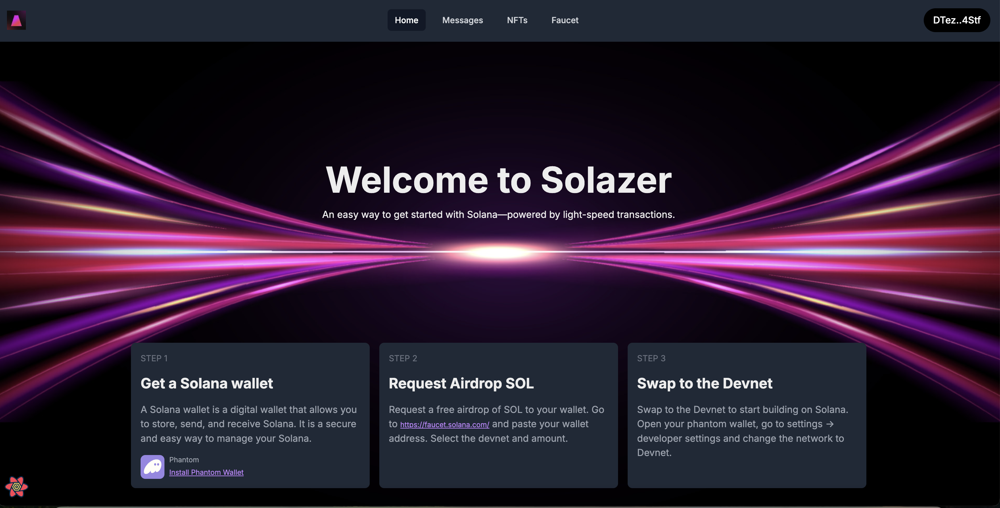
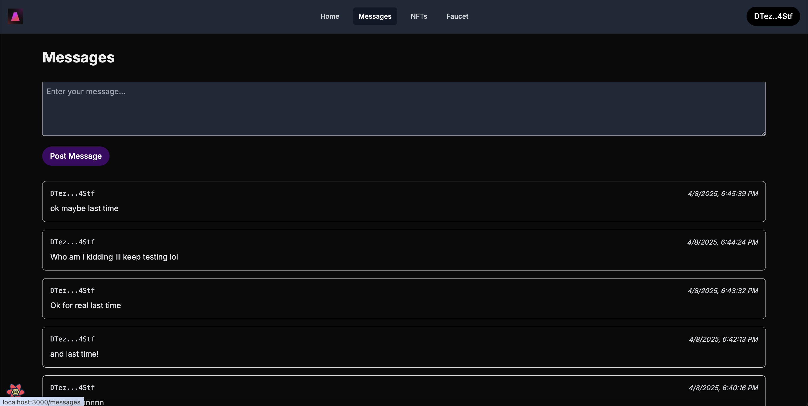
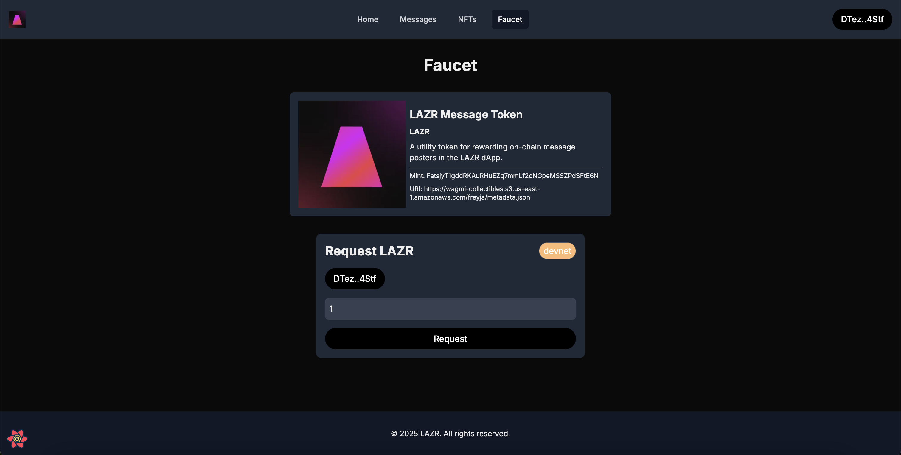
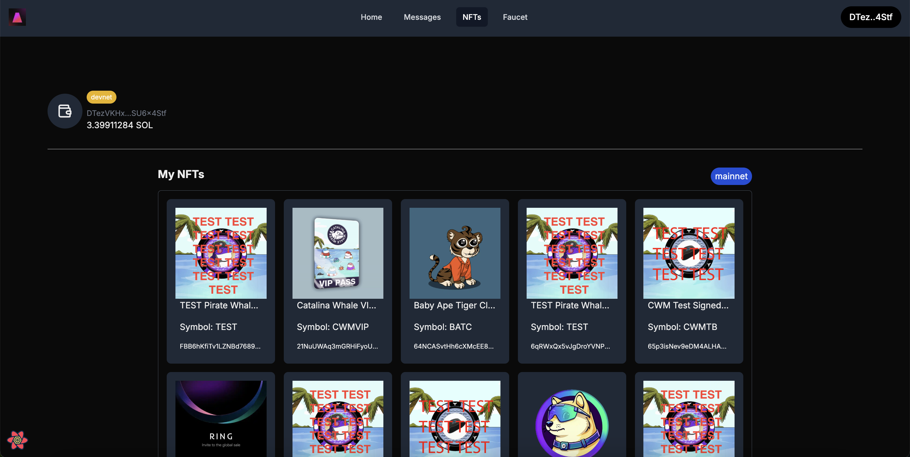

# 🔥 Solana Lazer

**Solana Lazer** is a full-stack demo application designed to showcase advanced Solana development using modern tooling. It features custom token minting, wallet airdrops, on-chain message posting via an Anchor smart contract, and real-time UI updates. Built to demonstrate practical system design knowledge and Solana integration.



---

## 🚀 Features

### 🔧 Smart Contracts
- **Rust / Anchor program**
  - Users can post messages stored on-chain.
  - Each message includes:
    - `author` (wallet pubkey)
    - `index` (auto-incremented)
    - `timestamp` (on-chain clock)
    - `message` (string)
  - Messages stored as PDAs, per-user state is tracked using a counter.
  - Events emitted for real-time indexing.
  - Events are captured by the backend and pushed via WebSocket to the frontend.

  

### 📦 Deployment Info
- **Program ID**: `CBrNSSuPm5fa9AVdgeYrswKKAcvcmKN85hrgEtnXKj98`
- **Cluster**: Devnet

### 🛠 Backend (NestJS)
- Uses **Metaplex’s Umi SDK** and `@solana/web3.js`
- Backend handles:
  - Token creation + metadata
  - Token minting and airdrops
  - Serialized transaction creation (server signs, user completes)
  - Fetching messages and NFTs
  - ATA (Associated Token Account) handling
  - Listens for smart contract events and emits WebSocket updates

### 🌐 Frontend (Next.js)
- Built with **React**, **TailwindCSS**, and `@solana/wallet-adapter`
- Users can:
  - Connect Phantom wallet
  - View SOL balance and NFTs
  - Airdrop a custom token (with auto ATA)
  - Post messages to Solana and view live feed





---

## 🧪 Testing & Devnet Deployment

1. Update `Anchor.toml` with your program ID and devnet cluster.
2. Run `anchor build && anchor deploy` to deploy smart contract.
3. Set your `.env` values in both backend and frontend:
   - `PRIVATE_KEY`, `HELIUS_API_KEY`, `PROGRAM_ID`, etc.
4. Run the app:
   - `pnpm dev` inside `/apps/web`
   - `pnpm start` inside `/apps/backend`

---

## 📱 Getting Started with Phantom + Solana

1. **Install Phantom Wallet**: [https://phantom.app](https://phantom.app)
2. Create a new wallet and copy your public key.
3. Airdrop Devnet SOL to your wallet:
   - Visit [https://solfaucet.com](https://solfaucet.com) or use the Solana CLI:
     ```bash
     solana airdrop 2 --url https://api.devnet.solana.com
     ```

---

## 📁 Project Structure

```
solana-stack/
├── apps/
│   ├── contracts/       # Anchor-based Solana program
│   │   └── transfer_program/
│   ├── backend/         # NestJS service using Solana + Metaplex
│   └── web/             # Next.js frontend
├── packages/
│   └── ui/              # Reusable components (Modal, Button, Card)
├── solana.json          # IDLs and build settings
├── Anchor.toml          # Anchor config
└── README.md
```

---

## 🎯 Demo Use Case

1. Connect Phantom wallet
2. Request LAZR token airdrop
3. Post a message to Solana
4. View live feed and NFT/token balances

---

## 🧠 Stack

- Solana (Anchor, Web3.js, Umi)
- NestJS (TypeScript)
- React + Next.js 14 (App Router)
- TailwindCSS + Custom UI Library
- Helius API for metadata

---

## 📜 License

MIT — Casey Charlesworth